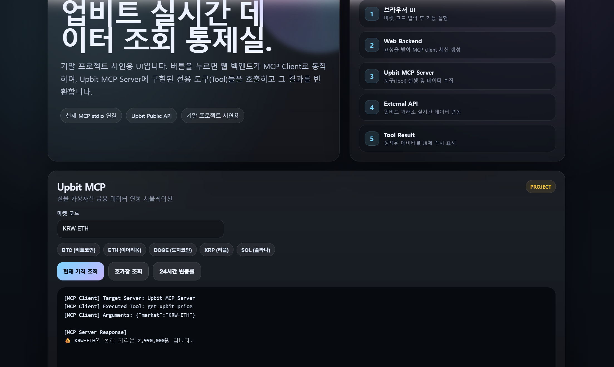

# Week 14 Assignment
*본 프로젝트는 2026-1 블록체인실습 기말 대체 프로젝트로 진행되었습니다.*

<br>

## 프로젝트 개요

  - 본 프로젝트는 **MCP(Model Context Protocol)** 아키텍처를 기반으로, 가상자산 거래소(Upbit)의 실시간 데이터를 조회하고 시각화하는 **업비트 데이터 연동 대시보드**를 구축하는 실습입니다.
  - 단순한 직접 API 호출 방식을 탈피하여, 기능을 제공하는 **MCP Server**와 이를 요청하는 **MCP Client**가 물리적·논리적으로 완벽하게 분리된 아키텍처를 구현합니다.
  - 브라우저 UI와 내부망의 MCP 프로토콜(stdio)을 연결하기 위해 **FastAPI 기반의 웹 미들웨어**를 도입하여, 사용자의 자연스러운 인터랙션이 내부 시스템의 도구 호출(Tool Call)로 이어지는 데이터 파이프라인을 완성합니다.

<br>

## 기술 스택
* **Backend Framework (Middleware):** Python 3, FastAPI, Uvicorn
* **Protocol & 통신:** MCP (Model Context Protocol) SDK, HTTPX (비동기 통신), JSON-RPC
* **Frontend:** HTML5, CSS3, Vanilla JavaScript
* **External API:** Upbit Public API (Ticker, Orderbook)

<br>

## 폴더 구조

```text
📦 week14_upbit-mcp-dashboard
├── 📂 clients/
│   └── 📜 test_mcp_client.py    # CLI 환경에서 동작하는 테스트용 MCP 클라이언트 (로깅 기능 포함)
├── 📂 logs/                     # 테스트 클라이언트 실행 결과가 자동 저장되는 로그 폴더
│   ├── 📄 mcp_result_log_20260530_190649.txt
│   └── 📄 mcp_result_log_20260530_191813.txt
├── 📂 servers/
│   └── 📜 upbit_server.py       # 업비트 API와 통신하며 도구(Tool)를 제공하는 핵심 MCP 서버
└── 📂 web/
    ├── 📜 index.html            # 사용자 인터랙션을 위한 브라우저 기반 통제실 UI
    └── 📜 web_app.py            # 브라우저 HTTP 요청을 MCP stdio 통신으로 변환하는 FastAPI 웹 서버
└── 📜 README.md               # 프로젝트 통합 가이드 및 설명서

```

## 전체 실행 흐름도

본 프로젝트는 클라이언트와 서버가 철저히 분리된 상태에서, 웹 브라우저의 조작이 내부 MCP 시스템을 거쳐 외부 API(업비트)에 도달하는 4단계 흐름을 거칩니다.

**1. 브라우저 UI 요청 (Web Frontend ➡️ Web Backend)**

* 사용자가 대시보드(`index.html`)에서 코인(마켓 코드)을 선택하고 '현재 가격 조회' 등의 버튼을 클릭합니다.
* 자바스크립트의 `fetch` 함수가 FastAPI 기반의 웹 백엔드(`web_app.py`)로 HTTP GET 요청을 전송합니다.

**2. MCP 세션 초기화 및 도구 탐색 (Web Backend ➡️ MCP Server)**

* 웹 백엔드는 **MCP Client**로 동작하여, `stdio` (표준 입출력) 파이프라인을 통해 `upbit_server.py` 프로세스를 백그라운드에서 실행합니다.
* 클라이언트는 서버와 세션을 맺고, 서버가 제공하는 도구 목록(`list_tools`)을 탐색하여 검증합니다.

**3. 데이터 수집 및 반환 (MCP Server ↔️ Upbit API)**

* 클라이언트가 특정 도구(`get_upbit_price`, `get_upbit_orderbook` 등)의 실행(`call_tool`)을 지시합니다.
* **MCP Server**는 내부 로직에 따라 Upbit Public API에 비동기 HTTP 요청(`httpx`)을 보내 데이터를 수집하고, 이를 정제하여 클라이언트에게 반환합니다.

**4. 데이터 렌더링 (Web Backend ➡️ Web Frontend)**

* 웹 백엔드는 MCP 서버로부터 돌려받은 실행 결과를 JSON 형태로 브라우저에 반환하며, 브라우저는 이를 시각적인 터미널 UI에 출력하여 사용자가 확인할 수 있도록 렌더링합니다.

## 실습 상세 내용 
| 단계 | 파일명 | 핵심 기능 | 상세 설명 |
| :---: | :--- | :--- | :--- |
| **1️⃣** | `upbit_server.py` | **MCP 데이터 제공 서버** | - `@mcp.tool()` 데코레이터를 활용하여 세 가지 핵심 도구(가격 조회, 호가창 Top 3 조회, 24시간 변동률 및 거래대금 조회)를 시스템에 등록합니다.<br>- `httpx`를 이용해 업비트 API와 비동기로 통신하며, 복잡한 JSON 응답을 인간이 읽기 쉬운 문자열 형태로 정제(가공)합니다. |
| **2️⃣** | `test_mcp_client.py` | **CLI 검증용 클라이언트** | - UI 없이 터미널 환경에서 서버와의 `stdio` 연결 무결성을 검증하는 단위 테스트 스크립트입니다.<br>- 실행 시 호출된 모든 데이터와 응답 내역을 `logs/` 폴더에 타임스탬프와 함께 `.txt` 파일로 영구 보관(Archiving)하는 기능을 포함합니다. |
| **3️⃣** | `web_app.py` | **FastAPI 미들웨어** | - 웹 브라우저의 HTTP 요청을 수신하는 진입점입니다.<br>- 내부적으로 `stdio_client`를 생성하여 MCP 서버의 도구를 동적으로 호출하고, 그 결과를 웹 호환 규격(JSON)으로 매핑하여 반환하는 브릿지 역할을 수행합니다. |
| **4️⃣** | `index.html` | **시각화 대시보드 UI** | - 사용자가 직관적으로 코인을 선택하고 기능을 테스트할 수 있는 프론트엔드 화면입니다.<br>- 단순히 결과만 보여주는 것이 아니라, 데이터가 어떤 서버와 도구를 거쳐 처리되었는지 MCP 메타데이터를 함께 출력하여 아키텍처의 투명성을 강조합니다. |


##  실행 결과 및 스크린샷

### 1. 웹 통제실(Web UI) 실행 화면
대시보드 구동 및 실시간 데이터 호출 성공 화면


### 2. CLI 클라이언트 실행 및 통신 로그
터미널을 통한 MCP 서버-클라이언트 통신 로그 아카이브
* [📝 mcp_result_log_20260530_190649.txt 파일 확인하기](./logs/mcp_result_log_20260530_190649.txt)
* [📝 mcp_result_log_20260530_191813.txt 파일 확인하기](./logs/mcp_result_log_20260530_191813.txt)


<details>
<summary>터미널 실행 로그 주요 내용 펼쳐보기 (클릭)</summary>

./logs/mcp_result_log_20260530_190649.txt

🔄 [클라이언트] 업비트 MCP 서버에 접속을 시도합니다...
✅ [클라이언트] 서버와 연결 성공!

🔍 [클라이언트] 서버의 도구 목록을 조회합니다...
 - 발견된 도구: get_upbit_price (업비트에서 특정 코인의 현재 가격 정보를 가져옵니다. (예: KRW-BTC, KRW-DOGE))
 - 발견된 도구: get_upbit_orderbook (업비트에서 특정 코인의 실시간 호가창(주문장) 데이터를 가져옵니다.)
 - 발견된 도구: get_upbit_24h_change (업비트에서 특정 코인의 24시간 변동률 및 거래대금을 가져옵니다. (기본값: 이더리움))
--------------------------------------------------
🚀 [클라이언트] 'get_upbit_price' 도구를 호출합니다!
📥 [서버 응답]: 💰 KRW-BTC의 현재 가격은 109,023,000원 입니다.

🚀 [클라이언트] 'get_upbit_orderbook' 도구를 호출합니다!
📥 [서버 응답]:
📊 [KRW-DOGE 실시간 호가창 Top 3]
 1. 🔴 매도 가격: 150원 | 🔵 매수 가격: 149원
 2. 🔴 매도 가격: 151원 | 🔵 매수 가격: 148원
 3. 🔴 매도 가격: 152원 | 🔵 매수 가격: 147원


🚀 [클라이언트] 'get_upbit_24h_change' 도구를 호출합니다!
📥 [서버 응답]: 📈 상승 KRW-ETH의 24시간 변동률은 0.17% 입니다. (24H 거래대금: 약 518억 원)

💾 [시스템] 위 터미널 로그가 'mcp_result_log_20260530_190649.txt' 파일로 폴더에 안전하게 저장되었습니다!

</details>

<br>

## 배포 및 테스트 시 주의사항

시스템의 구조적 분리로 인해 프로세스 간 통신(IPC) 및 경로 설정에서 발생할 수 있는 주요 예외 상황과 해결 방안입니다.

### 1. 상대 경로 인식 오류 (FileNotFoundError)

웹 백엔드(`web_app.py`) 구동 시 터미널의 현재 실행 위치(Current Working Directory)에 따라 `index.html`이나 `upbit_server.py`를 찾지 못하는 문제가 발생할 수 있습니다.

* **해결 방안:** 파일 경로를 하드코딩하지 않고, `os.path.abspath(__file__)`을 활용하여 시스템 절대 경로를 동적으로 추적하도록 코드를 수정하여 터미널 실행 위치와 무관하게 시스템이 동작하도록 방어 로직을 적용했습니다.

### 2. 가상 환경 파이썬 런타임 충돌 (TaskGroup Error)

웹 백엔드가 MCP 서버를 자식 프로세스로 호출할 때, `command="python"`으로 지정할 경우 운영체제가 `.venv` 가상 환경이 아닌 로컬 시스템의 전역 파이썬을 호출하여 모듈 탐색 오류가 발생합니다.

* **해결 방안:** 서버 실행 파라미터(Args)에 `sys.executable` 변수를 주입하여, 현재 백엔드를 구동 중인 가상 환경의 파이썬 인터프리터를 MCP 서버 구동에도 강제 사용하도록 런타임을 고정했습니다.

### 3. Public API 호출 제한 (Rate Limit)

업비트 Public API는 과도한 트래픽을 방지하기 위해 초당 호출 횟수 제한(Rate Limit)을 적용합니다.

* 짧은 시간 내에 대시보드의 버튼을 연속적으로 클릭할 경우 서버가 일시적으로 IP를 차단할 수 있으므로, 테스트 시 호출 간격에 여유를 두어야 합니다.

## 실행 가이드

본 프로젝트를 로컬 환경에서 실행하기 위한 명령어 가이드입니다. (가상 환경이 활성화되어 있어야 합니다.)

### 1. 의존성 패키지 설치

```bash
pip install mcp httpx fastapi uvicorn
```

### 2. 웹 기반 대시보드 서버 실행

```bash
# 프로젝트 최상위 폴더(week14_upbit-mcp-dashboard) 경로에서 실행
python web/web_app.py
```

* 서버가 정상적으로 실행되면 터미널에 `Uvicorn running on http://127.0.0.1:8765` 메시지가 출력됩니다.

### 3. 서비스 접속

인터넷 브라우저(Chrome, Edge 등)를 열고 주소창에 아래 URL을 입력하여 대시보드에 접속합니다.

```text
[http://127.0.0.1:8765](http://127.0.0.1:8765)
```
